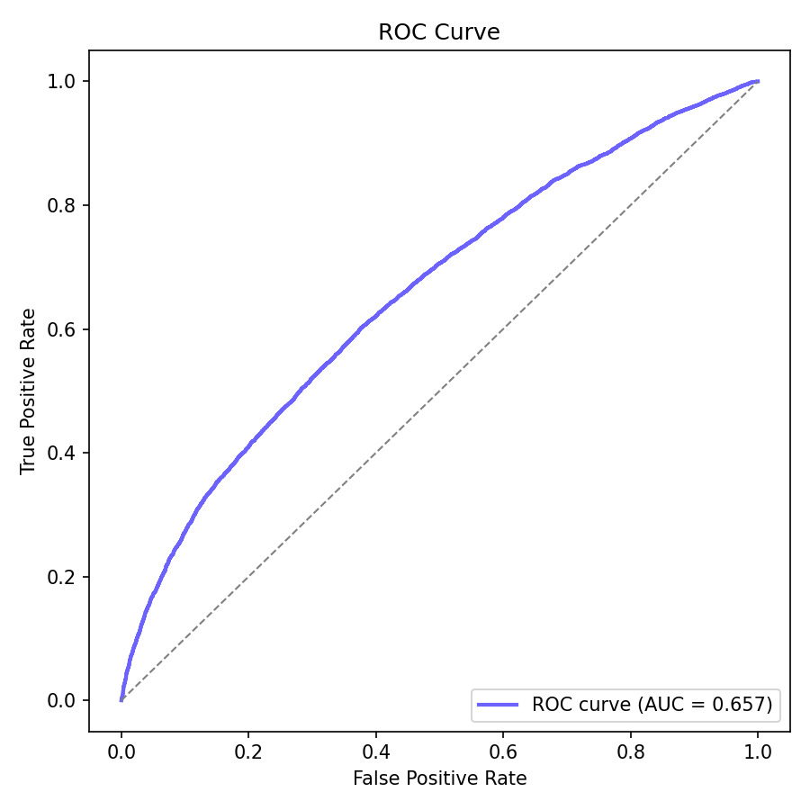

Diabetes Classification — notes

Place the dataset CSV `diabetes_dataset.csv` in this folder.

Install dependencies (recommended in a venv):

```bash
python -m venv .venv
.\.venv\Scripts\activate
pip install -r ../../requirements.txt
```

Run:

```bash
python diabetes_classification.py
```

Notes:
- The script drops several columns considered data leakage — verify dataset schema matches expected columns.
- If you encounter `OneHotEncoder` issues ensure scikit-learn version >= 1.2 for `sparse_output` support.

Results (this run)

- Model: XGBoost Classifier
- Preprocessing: drop leakage columns, OneHot encode categoricals, set `scale_pos_weight` for class imbalance
- Metrics (this run): ROC_AUC: 0.6565783177083333
- Threshold tuning (this run): best threshold 0.36 — recall 0.90, precision 0.63

Visuals:



Notes: run `python diabetes_classification.py` in this folder to reproduce these artifacts locally. The script saves `diabetes_xgb.joblib` and `roc_curve.png`.
